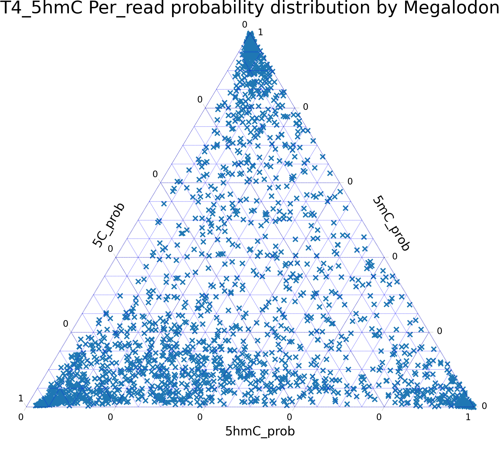

# Megalodon 5hmC calling 
## **1.Per read results**
### **1.1 Use Megalodon to do 5hmC calling for hydroxymethylated T4 (100% 5hmC), methylated lambda (100% 5mC), unmethylated lambda (100% 5C), APL (mixed status)**

Megalodon v2.3.3 with Guppy v5.0.11

model: res_dna_r941_min_modbases_5mC_5hmC_v001

For a specific site, Megalodon will predict the probability of being 5hmC, 5mC and 5C

P(5hmC_prob) + P(5mC_prob) + P(5C_prob) = 1

Result: Per-read methylation calling

```python
# Per_read result from Megalondon (trimed)
chr	      start	read_id	                            strand	5hmC_prob	           5mC_prob	            5C_prob
J02459.1	42	4d9dedd9-47db-4455-8afe-d7333b34587a	+	0.0006429135954517633	0.9948078470851646	0.0045492393193836715
J02459.1	42	806a6387-a444-4f1b-b2e2-eb4277452301	+	0.013510789488459077	0.9485275304920909	0.03796168001945001
``` 
Megalodon per-read file is 0-based file. 

col0 - chromosome information

col1 - Start position of CpG

col2 - read_id

col3 - strand information

col4 - 5hmC_prob, probability that the base is hydromethylated (float expected).

col5 - 5mC_prob, probability that the base is methylated (float expected).

col6 - 5C_prob, probability that the base is unmodified (float expected).

### **1.2 Plot Megalodon per_read probabilty result for hydroxymethylated T4 (100% 5hmC), methylated lambda (100% 5mC), unmethylated lambda (100% 5C)**

T4_5hmC: `T4_5hmC/T4_5hmC.Megalodon.per_read.png`


lambda_5mC: `lambda_5mC/lambda_5mC.Megalodon.per_read.png`

lambda_5C: `lambda_5C/lambda_5C.Megalodon.per_read.png`


## **2. Per site results**
### **2.1 Aggregate per read results into hydroxymethylated frequency (5hmC%) at site level**

*Pseudocode: set up different cut-off to convert per_read results into per_site results*
```python
## 1. Correct strand information for negative strand 
if strand == "-":
    start = start + 1
elif strand == "+":
    start = start
                
## 2. set up different cut-off to convert per_read 5hmC_probability into 5hmC% (5hmC frequency) at site level 
## 2-way classifier: 5hmC/non_5hmC 
## if P(5hmC) > prob_threshold: 5hmC  read
## P(5hmC) < 1-prob_threshold: non_5hmC read (non_5hmC = 5mC + 5C)
### 1-prob_threshold <= P(5hmC) <= prob_threshold: ambiguous reads, discard

prob_threshold = [0, 0.1, 0.2, 0.3, 0.4, 0.5 ,0.6, 0.7, 0.8, 0.9, 1.0]
if 5hmC_prob > prob_threshold: ##Count 5hmC reads
    number_of_5hmC_read += 1
    number_of_coverage += 1
elif hydroxymethyl_prob < 1 - prob_threshold:  ##Count non_5hmC reads
    number_of_non_5hmC_read += 1
    number_of_coverage += 1
else:  ## Ignore ambiguous reads 
    continue
                
# For a specific site:
5hmC% = number_of_5hmC_read / number_of_coverage
non_5hmC% = number_of_non_5hmC_read / number_of_coverage
```
Potential problem:
when prob_threshold >= 0.5:
prob_threshod <=  1 - prob_threshold
e.g. prob_threshold = 0.7:


### **2.2 Plot Megalodon per_site 5hmC% for T4_5hmC, lambda_5mC, lambda_5C, APL**

prob_threshold = [0, 0.1, 0.2, 0.3, 0.4, 0.5 ,0.6, 0.7, 0.8, 0.9, 1.0]

T4_5hmC: `T4_5hmC/T4_5hmC.Megalodon.per_site.prob_threshold.png`

lambda_5mC: `lambda_5mC/lambda_5mC.Megalodon.per_site.prob_threshold.png`

lambda_5C: `lambda_5C/lambda_5C.Megalodon.per_site.prob_threshold.png`

APL: `APL/APL.Megalodon.per_site.prob_threshold.png`

